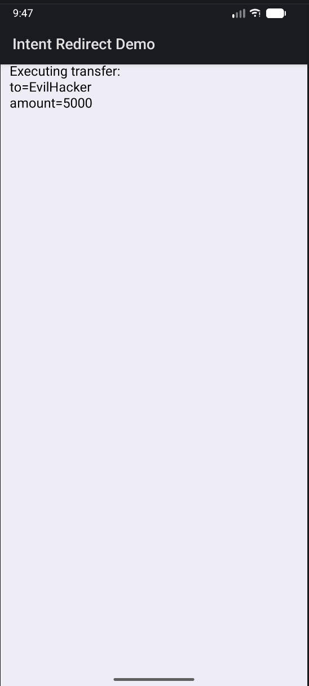

# Intent Redirection Demo (Android)

This is a small Android demo app that shows how a deep link can lead to an intent redirection vulnerability.

## Attack Flow

```
mybank://transfer?to=EvilHacker&amount=5000
        ↓
Android matches intent-filter
        ↓
TransferActivity (deep link entry)
        ↓
TransferActivity forwards the intent (vulnerability)
        ↓
ConfirmTransferActivity executes
```

## Project Structure (Key Files)

- `app/src/main/AndroidManifest.xml` — Declares activities and the deep link intent-filter.
- `app/src/main/java/com/example/androiddemoapp/TransferActivity.kt` — Receives the deep link and forwards it without validation.
- `app/src/main/java/com/example/androiddemoapp/ConfirmTransferActivity.kt` — Displays the transfer details.
- `app/build.gradle` — App module configuration (SDK levels, deps).
- `local.properties` — Local Android SDK path (not committed to Git).

## Requirements

- Android SDK installed (via Android Studio or CLI).
- Java 17+ (this project uses Java 20 in examples).

## Run With Android Studio

1. Open Android Studio.
2. `Open` the `Android-demo-app` folder.
3. Let Gradle sync finish.
4. Create/start an emulator (Device Manager) or connect a device.
5. Click `Run` (green triangle) to install the app.

Trigger the deep link:

```bash
adb shell am start -a android.intent.action.VIEW -d "mybank://transfer?to=EvilHacker&amount=5000" -n com.example.androiddemoapp/.TransferActivity
```

If `adb` is not on your PATH (macOS default):

```bash
~/Library/Android/sdk/platform-tools/adb shell am start -a android.intent.action.VIEW -d "mybank://transfer?to=EvilHacker&amount=5000" -n com.example.androiddemoapp/.TransferActivity
```

## Run From Terminal (No Android Studio)

Make sure your emulator/device is running and visible to `adb`:

```bash
"$HOME/Library/Android/sdk/platform-tools/adb" devices
```

Build APK:

```bash
cd "<path>/Android-demo-app"
export ANDROID_SDK_ROOT="$HOME/Library/Android/sdk"
export JAVA_HOME="/Users/shreyshah/Library/Java/JavaVirtualMachines/openjdk-20.0.1/Contents/Home"
export GRADLE_USER_HOME="$PWD/.gradle"
./gradlew assembleDebug
```

Install APK:

```bash
"$HOME/Library/Android/sdk/platform-tools/adb" install -r app/build/outputs/apk/debug/app-debug.apk
```

Trigger deep link:

```bash
"$HOME/Library/Android/sdk/platform-tools/adb" shell "am start -a android.intent.action.VIEW -d 'mybank://transfer?to=EvilHacker&amount=5000' -n com.example.androiddemoapp/.TransferActivity"
```

## Screenshots

Add your Android Studio emulator screenshots below:

<!-- Replace the src with your screenshot filename -->


## Notes

- If you launch the app from the launcher icon, the deep link data is missing (no `to` or `amount`). Always trigger via the deep link command.
- If you see a Gradle warning about `compileSdk`, it’s because the Android Gradle plugin was tested up to API 34. You can suppress it by adding this line to `gradle.properties`:

```
android.suppressUnsupportedCompileSdk=36
```

## GitHub

Recommended to commit these:
- `app/`, `build.gradle`, `settings.gradle`, `gradle.properties`
- `gradlew`, `gradlew.bat`, `gradle/wrapper/`

Ignore:
- `build/`, `.gradle/`, `.idea/`, `local.properties`
